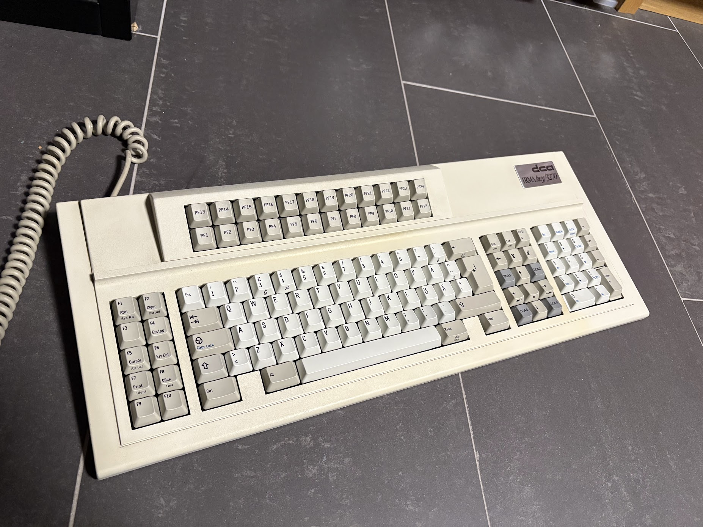

# IRMAkey/3270 notes 

I have a old IRMAkey/3270 keyboard I've repurposed for office use that I use at work.
This repo contains some quick notes/pics that people may find useful if they want to do that as well.

It uses vintage Cherry MX White switches except for the DCA1-4 keys which have some black switches that require a huge amount of force to depress. Desoldering old switches and mounting modern more quiet ones is not hard, and makes it more usable in an open office setting.

I went ahead and used Cherry MX Red + O-rings which works well for me.

By default, the key bindings are not really usable, but with a Soarer's converter, remapping this is simple. binding.sc and macros.sc contains the config I use.

notes.txt has some notes on default bindings, output from EasyHIDListen.

Misc pics below:

